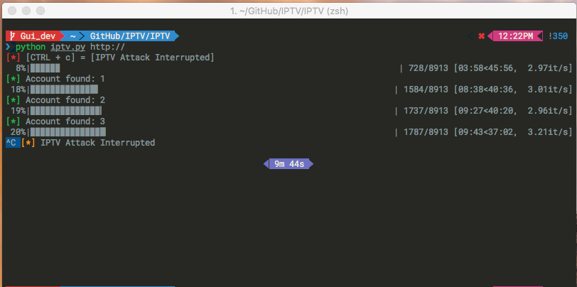

# IPTV. [DEPRECATED] 

## Disclaimer

   This program is just a demonstration. **It's not intended** for personal purpose.

## What is this?

IPTV is a simple python program that let you crawl the search engines
in order to fetch those sites that stream illegal tv programs.

This script leverage the fact the a lot of those sites use the same
CMS to create the web application and sharing the service, behind a CMS there's
always some exploits.
We are using one simple exploit to grab and crawl the site's url and use for our
purpose, we have discovered a lot of those exploits.

## Ethical Dilemma

Even though those services are illegal, stealing from a thief is still stealing.

Using this program for your personal use is illegal.

## External dependencies

If you want to use the `iptv_gui` version you need to install `PyQt` first

* On Linux you can simply search it from your preferred package manager, for example
on Ubuntu/Debian `sudo apt-get install pyqt4-dev-tools`
* On Mac OSX you can use *brew* to install it `brew install sip` && `brew install pyqt`
* On Windows yu can download the official .exe from the PyQt site.

## How to use the CLI version

* Clone the repository `git clone git@github.com:Pirate-Crew/IPTV.git`
* `cd` into `iptv`
* run `pip install -r requirements.txt` in order to get the full dependencies
* run `python iptv.py`
* Use the application menu to do stuff

## How to use the GUI version

* Clone the repository `git clone git@github.com:Pinperepette/IPTV.git`
* `cd` into `iptv`
* run `pip install -r requirements.txt` in order to get the full dependencies
* run `python iptv_gui.py`
* you can see an example of the GUI in the image below

## Compatibility

This program work on Window, Linux, Mac OSX and BSD. The only requirement is
python, better if python 2!

## License

See [the license](LICENSE) for further details

## Contributing

Contributes are welcome and much appreciated, please read the [contributing guide](CONTRIBUTING.md) for further information.
